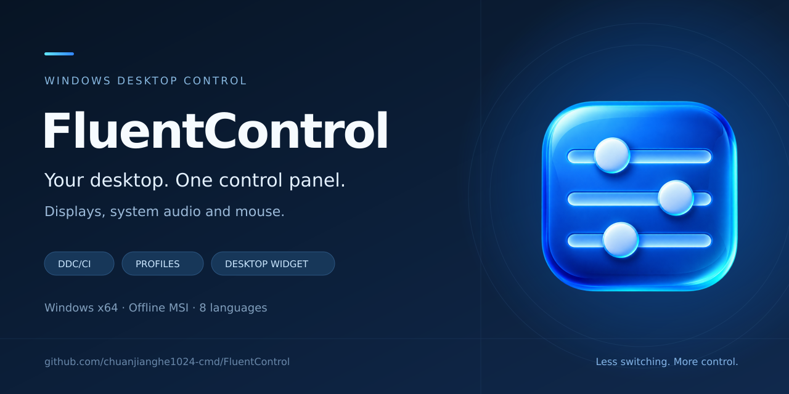

# FluentControl · 聚合控制

**多屏、声音、麦克风与鼠标，一个面板就够。**  
**Your displays, audio, microphone and mouse — in one panel.**

Windows 11 风格 · Windows x64 · 离线 MSI 安装 · 8 种界面语言

[简体中文](#zh-cn) · [English](#en) · [下载 / Download](https://github.com/chuanjianghe1024-cmd/FluentControl/releases/latest) · [更新记录 / Changelog](CHANGELOG.md) · [反馈 / Issues](https://github.com/chuanjianghe1024-cmd/FluentControl/issues)

## 让桌面设备跟上你的使用场景

FluentControl 是一款面向 Windows 的 **DDC/CI 显示器亮度与多屏控制工具**，同时提供系统音量、输入和鼠标调节。把分散在显示器实体按键、系统声音设置和鼠标设置中的常用操作，放进统一的 Fluent 风格界面。

从办公切换到游戏、从白天切换到夜间，保存一套配置后就能再次调用。多台显示器可以一起调，也可以分别调；常用控制还能留在桌面上，减少反复打开窗口和寻找菜单的操作。

### 它解决什么问题

| 你遇到的情况 | FluentControl 的做法 |
| --- | --- |
| 多块屏幕亮度不同，逐台按按钮很麻烦 | 整体或单独调节，并为每屏设置亮度映射 |
| 办公、游戏、夜间需要重复调整设备 | 保存显示器、声音、麦克风和鼠标的总配置，随时切换 |
| 好用的显示器参数难以整理、迁移和复用 | 按型号管理预设，支持批量导入、导出与兼容性检查 |
| 常用控制分散在多个系统窗口 | 用主面板、托盘、快捷键和半透明桌面面板快速操作 |

### 主要功能

- **显示器控制**：在硬件支持时调节亮度、对比度、色温预设、RGB、Gamma、饱和度、显示模式、输入源和屏幕音量等。
- **跨型号多屏联动**：不同型号也能整体调节；只向支持对应功能和选项的屏幕发送设置，并标明部分支持的情况。
- **总配置与型号预设**：总配置保存整套设备状态，型号预设保存可复用的单屏参数。更新时保留离线设备参数，修改库中预设不会悄悄改变已有总配置。
- **声音、麦克风与鼠标**：调节声音和输入的音量与静音、鼠标速度和指针大小。音频简化为「音量」「输入」两项，自动跟随 Windows 当前默认选择；虚拟声卡同样通过系统控制，不需要在 FC 中重新选择或绑定。
- **桌面面板与快捷操作**：半透明、可移动和缩放；双击立即解锁并前置，失焦或 Esc 锁定；支持 Win+D 显示桌面、托盘驻留和全局快捷键。
- **每屏软件菜单与诊断**：通过 FC 屏幕菜单集中调节当前屏幕，采集只读诊断信息，为具体型号适配提供依据。
- **手动更新与分类设置**：设置按常规、显示器、快捷键、桌面面板、准星、关于与更新分类；主动检查 GitHub 正式版，下载校验后自行选择安装。
- **离线使用与多语言**：本地配置和 JSON 分享文件无需在线账户；支持简体中文、繁體中文、English、日本語、한국어、Deutsch、Français、Español。

### 下载与开始使用

**[下载最新正式版 MSI](https://github.com/chuanjianghe1024-cmd/FluentControl/releases/latest)** · 当前正式版 **v0.3.60** · [版本说明](docs/releases/v0.3.60.md)

1. 下载并安装 MSI，从开始菜单打开 FluentControl。安装包包含所需运行库，可离线安装，无需管理员权限。
2. 在外接显示器的实体菜单中开启 **DDC/CI**，连接后读取设备。
3. 为屏幕命名，选择整体或单独控制，保存第一套配置。
4. 按需开启桌面面板、快捷键和开机自启动。

主要面向 **Windows 11 x64**。升级前请从托盘彻底退出旧版本；升级和卸载均保留个人配置。当前正式安装包未做代码签名，Windows 可能显示“发布者未知”。开发分支的后续修复见 [更新记录](CHANGELOG.md)，测试安装包见 [Windows build](https://github.com/chuanjianghe1024-cmd/FluentControl/actions/workflows/build.yml)。

### 兼容性与当前进展

显示器可用功能取决于型号、固件、连接方式和当前模式。HDR、节能模式、转接器及扩展坞可能限制调节；带有音频输出也不一定支持显示器硬件音量遥控。FC 软件菜单已提供，**直接打开和导航显示器原厂 OSD 仍需经过验证的型号适配**。

**本地预设、JSON 导入导出已可用。** 配置分享站与在线型号适配库尚未部署，在线查询及报告提交暂不可用。计划域名为 [fctrl.app](https://fctrl.app)，配套网站独立维护于 [FluentControl-Web](https://github.com/chuanjianghe1024-cmd/FluentControl-Web)。

### 后续方向

| 方向 | 目标 |
| --- | --- |
| 更好的显示器兼容性 | 持续验证色温、场景模式、HDR 和原厂菜单控制，积累可靠的型号适配 |
| 配置分享与适配库 | 上线型号预设分享、适配查询、诊断提交及审核流程 |
| 更自然的多设备使用 | 改善插拔识别、离线设备管理、外部按键调节后的状态同步 |
| 按场景自动调节 | 探索应用联动、定时配置和更多快捷操作 |

以上是后续方向，未承诺发布时间。详细开发任务和验收条件维护在 [agent.md](agent.md)。

### 参考项目与参与方式

以下项目为显示器控制与适配研究提供参考，具体功能仍以 FC 对相应硬件的验证为准。

| 项目 | 参考内容 |
| --- | --- |
| [ddcutil](https://github.com/rockowitz/ddcutil) | DDC/CI 控制、能力处理与自定义功能定义 |
| [ddccontrol-db](https://github.com/ddccontrol/ddccontrol-db) | 按型号维护显示器控制描述的数据库 |
| [msigd](https://github.com/couriersud/msigd) | MSI 显示器 USB/HID 控制与型号差异处理 |
| [ddc-mode-switcher](https://github.com/Gunther-Schulz/ddc-mode-switcher) | 特定 ASUS 型号的原厂 OSD 指令序列 |
| [ddc-toolkit](https://github.com/andres-valencia/ddc-toolkit) | 特定 Lenovo 型号的私有控制映射与证据记录 |

欢迎通过 [Issues](https://github.com/chuanjianghe1024-cmd/FluentControl/issues) 提交问题、功能建议和型号兼容性反馈。报告时附上软件版本、显示器型号、连接方式和复现步骤；诊断信息请先检查并移除不想公开的内容。开发者与 AI 协作入口见 [agent.md](agent.md)。

---

## Make your desktop fit what you are doing

FluentControl is a **Windows DDC/CI monitor brightness and multi-monitor control app** with system volume, input and mouse controls in one Fluent-style interface.

Save a setup for work, gaming or late-night use and recall it when needed. Adjust multiple displays together or individually, and keep frequent controls on a translucent desktop panel.

### Problems it solves

| Everyday friction | What FluentControl offers |
| --- | --- |
| Adjusting several monitors means reaching for several sets of buttons | Linked or individual controls with per-display brightness mapping |
| Changing activities requires repeating the same device adjustments | Global profiles for display, audio, microphone and mouse settings |
| Useful monitor settings are difficult to organize, move and reuse | Model-based presets, batch import/export and compatibility checks |
| Frequent controls are spread across several settings windows | One main panel, a tray menu, hotkeys and a desktop panel |

### Features

- **Monitor controls**: brightness, contrast, color presets, RGB, gamma, saturation, picture modes, input source, monitor volume and more, where supported by the hardware.
- **Linked controls across models**: adjust different monitor models together. Settings go only to displays that support the selected feature or option, with partial support clearly indicated.
- **Global profiles and monitor presets**: save a complete device setup or reusable settings for one monitor model. Updates retain offline device settings; editing a library preset does not silently change existing profile snapshots.
- **Audio, microphone and mouse**: adjust output/input volume and mute, mouse speed and pointer size. Audio is simplified to **Volume** and **Input**, following the current Windows defaults, including virtual audio endpoints, without selecting or binding devices in FC.
- **Desktop panel and shortcuts**: a movable, resizable translucent panel, double-click to unlock and immediately bring it forward, blur or Esc to lock, support for Win+D, tray operation and global hotkeys.
- **Per-display software menu and diagnostics**: adjust a display through the FC on-screen menu and collect read-only diagnostics for model-specific adaptation.
- **Manual updates and organized settings**: browse General, Displays, Shortcuts, Desktop controls, Crosshair, and About & updates. Check GitHub stable releases on demand, verify the download, and choose when to install.
- **Offline use and eight languages**: local profiles and JSON sharing files need no online account. Available in Simplified Chinese, Traditional Chinese, English, Japanese, Korean, German, French and Spanish.

### Download and get started

**[Download the latest stable MSI](https://github.com/chuanjianghe1024-cmd/FluentControl/releases/latest)** · Current stable release: **v0.3.60** · [Release notes](docs/releases/v0.3.60.md)

1. Install the MSI and open FluentControl from the Start menu. Required runtimes are included; installation works offline without administrator privileges.
2. Enable **DDC/CI** in your external monitor's physical menu, then let the app read your devices.
3. Name your displays, choose linked or individual control, and save your first profile.
4. Enable the desktop panel, hotkeys or startup option as needed.

Primarily designed for **Windows 11 x64**. Fully exit the previous version from the tray before upgrading. Upgrades and uninstallation retain personal settings. The current stable installer is unsigned, so Windows may show an unknown-publisher prompt. Later development changes are listed in the [changelog](CHANGELOG.md); test installers are available from [Windows build](https://github.com/chuanjianghe1024-cmd/FluentControl/actions/workflows/build.yml).

### Compatibility and current status

Available monitor controls depend on the model, firmware, connection and active mode. HDR, power-saving modes, adapters and docks may restrict adjustments. An audio output does not necessarily provide remote control of the monitor's hardware volume. The FC software menu is available; **opening and navigating a monitor's native OSD requires a verified model-specific adapter**.

**Local presets and JSON import/export are available.** The sharing service and online adapter catalog have not been deployed, so online lookup and report submission are not available yet. The planned domain is [fctrl.app](https://fctrl.app); the companion website is maintained separately in [FluentControl-Web](https://github.com/chuanjianghe1024-cmd/FluentControl-Web).

### Roadmap

| Direction | Goal |
| --- | --- |
| Better monitor compatibility | Validate color presets, picture modes, HDR behavior and native menu controls; build a reliable adapter catalog |
| Sharing and model adapters | Launch preset sharing, adapter lookup, diagnostic submission and review workflows |
| Smoother multi-device use | Improve hot-plug detection, offline device management and synchronization after physical OSD changes |
| Context-aware adjustments | Explore application-triggered profiles, scheduled adjustments and more shortcuts |

These are planned directions without committed release dates. Detailed engineering tasks and acceptance criteria are maintained in [agent.md](agent.md).

### References and contributions

These projects inform monitor-control and adaptation research. FC support still depends on validation against the relevant hardware.

| Project | Reference area |
| --- | --- |
| [ddcutil](https://github.com/rockowitz/ddcutil) | DDC/CI control, capability handling and user-defined features |
| [ddccontrol-db](https://github.com/ddccontrol/ddccontrol-db) | A database of model-specific monitor control descriptions |
| [msigd](https://github.com/couriersud/msigd) | USB/HID control and model differences for MSI monitors |
| [ddc-mode-switcher](https://github.com/Gunther-Schulz/ddc-mode-switcher) | Native OSD command sequences for a specific ASUS model |
| [ddc-toolkit](https://github.com/andres-valencia/ddc-toolkit) | Private control mappings and recorded evidence for a specific Lenovo model |

Bug reports, feature ideas and monitor compatibility reports are welcome in [Issues](https://github.com/chuanjianghe1024-cmd/FluentControl/issues). Include your app version, monitor model, connection and reproduction steps. Review diagnostics and remove anything you do not want to publish. Developer and AI collaboration guidance starts at [agent.md](agent.md).
